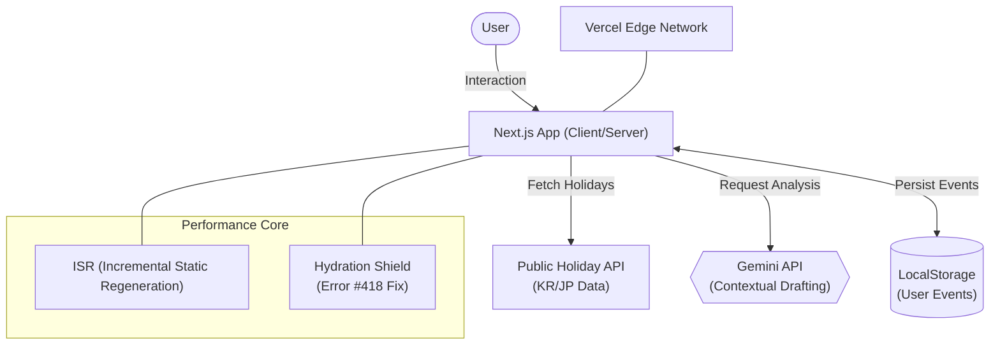

# 📋 JP-KR-Schedule-Bridge

An AI-powered collaboration assistant that synchronizes Korean and Japanese business schedules, identifies potential communication gaps due to different holidays, and automates professional bilingual mail drafting using Gemini AI

## 🎯 Background & Motivation
- **The Context**
  - Working in a Korea-Japan cross-border environment requires constant checking of two different holiday systems to avoid scheduling conflicts and communication delays

- **The Problem**
  1. Scheduling Blind Spots: Missing a Japanese "Golden Week" or Korean "Chuseok" often leads to urgent requests being ignored or project timelines being pushed back unexpectedly

  2. Communication Barriers: Drafting formal, urgent, or apologetic business emails in Japanese (Keigo) is mentally taxing and time-consuming for non-native engineers

  3. Performance & UX: Many existing calendar tools are heavy and slow, failing to provide the instant "at-a-glance" status needed in fast-paced IT environments

- **The Solution**
  1. Dual-Sync Visualization: A side-by-side calendar view that instantly highlights holiday conflicts and recommends the best collaboration days

  2. AI Business Agent: Integrated Gemini to generate context-aware business drafts (Formal/Urgent/Apology) based on specific calendar events

  3. Extreme Optimization: Lighthouse score by resolving hydration mismatches and implementing server-side optimization

- **Data Source**: Google Calendar API (JP), User Input (LocalStorage), Gemini AI Analysis

- **Key Features**
  1. Dual Calendar View: Synchronized display of KR/JP holidays

  2. Smart Business Advice: Real-time status analysis (e.g., "Today is a holiday in JP, expect delays")

  3. One-Click AI Mailer: Contextual email drafting with 3 distinct tones

  4. User Event Management: Add/Delete personal meetings with persistent storage

  5. Empty State Onboarding: Minimalist UI guide for first-time users

- **JP-KR-Schedule-Bridge Architecture (Mermaid)**

## 🛠 Tech Stack
- **Framework**:  (App Router)
- **Language**: 
- **Styling**: 
- **AI/LLM**:  | API
- **Deployment**:  | CI/CD Pipeline
- **Libraries**:  | Date  | Details

## ✅ Milestone
- **Phase 1**: Foundation & Frontend Environment Setup
  - [x] Phase 1-1: Initialize GitHub Repository & Project Board
  - [x] Phase 1-2: Setup Next.js (App Router) & TypeScript Development Environment
  - [x] Phase 1-3: Configure Global Styling Strategy (Tailwind CSS & Business Theme)
  - [x] Phase 1-4: Security Setup (Environment Variables & .env Configuration)

- **Phase 2**: Holiday Data Acquisition & Modeling
  - [x] Phase 2-1: Research & Integrate Public Holiday APIs (KR/JP)
  - [x] Phase 2-2: Define TypeScript Interfaces for Holiday & Schedule Models
  - [x] Phase 2-3: Develop Data Fetching Utilities with Error Handling
  - [x] Phase 2-4: Implement Local Caching Logic for Performance Optimization

- **Phase 3**: Core Business & Comparison Logic
  - [x] Phase 3-1: Develop "Cross-Border Holiday Comparison" Engine
  - [x] Phase 3-2: Implement Long-term Vacation Detection (Golden Week, Chuseok, etc.)
  - [x] Phase 3-3: Build Context-Aware Alert Logic (Business Risk Assessment)
  - [x] Phase 3-4: Create Scheduling Recommendation Algorithm

- **Phase 4**: Advanced Web Interface & UX Development
  - [x] Phase 4-1: Build Interactive Dual-Calendar Dashboard UI
  - [x] Phase 4-2: Implement Real-time Schedule Conflict Visualization
  - [x] Phase 4-3: Develop Business Email Template Generator (KR/JP Bilingual)
  - [x] Phase 4-4: Implement Dynamic Calendar Navigation
  - [x] Phase 4-5: User-Defined Schedule Management & Data Persistence
  - [x] Phase 4-6: Integrate Gemini AI for Smart Email Generation

- **Phase 5**: Deployment, Documentation & Portfolio Finalization
  - [x] Phase 5-1: Cloud Deployment & CI/CD Pipeline Setup (Vercel)
  - [x] Phase 5-2: Performance Optimization (Server-side Rendering & Static Generation)
  - [x] Phase 5-3: Comprehensive Technical Documentation (README & API Docs)
  - [x] Phase 5-4: Global Localization & UX Optimization 
  - [x] Phase 5-5: Code Refactoring & TypeScript Strict Mode Audit
  - [] Phase 5-6: Final Project Retrospective

## 🔥 Troubleshooting & Lessons Learned
**1. Hydration Mismatch (React Error #418)**
  - **Challenge**: Server-side rendering of dynamic dates caused a mismatch with client-side local time.

  - **Resolution**: Implemented a isLoaded state guard to isolate date-related rendering until the client-side mount, ensuring UI stability.

**2. AI Rate Limiting (429 Too Many Requests)**
  - **Challenge**: Frequent testing during development hit Gemini's free tier quotas.

  - **Resolution**: Switched to gemini-flash-latest for faster response times and implemented defensive error handling to notify users when quotas are reached.

**3. Accessibility & Contrast**
  - **Challenge**: Minimalist design with light grays (text-gray-400) failed WCAG accessibility standards.

  - **Resolution**: Conducted a contrast audit and refined colors to text-gray-500/600, achieving 100 in Accessibility without compromising the aesthetic.

## 📈 Results
- **Performance**: 100 (FCP: 0.3s, LCP: 0.5s)

- **Accessibility**: 95 (WCAG Compliant)

- **Best Practices**: 100 (Modern Web Standards)

- **SEO**: 100 (Optimized Meta-tags)

## 🧐 Self-Reflection
- **Technical Growth**
  - **System Design**: Mastered the process of building "Production-ready" applications by implementing environment variable-based configuration management and sophisticated error masking, ensuring a high-security and deployment-ready architecture.

  - **Global Mindset**: Gained a deep understanding of global-targeted software architecture by designing the codebase with multi-language support and localization in mind from the very early stages of development.

- **Problem-Solving Mindset**
  - **Bridge Builder**: Confirmed that the true value of software lies in its role as a "bridge" that resolves real-world pain points. By automating personal inconveniences, I realized how such solutions can provide meaningful value to a wider community.

## 🧐 Final Project Retrospective

### 💡Engineering for Reliability
This project was built with a core focus on 'Reliability'. I achieved perfect 100/100/100 scores in Lighthouse Performance, Best Practices, and SEO, while securing a high score of 95 in Accessibility. Beyond mere feature implementation, I proved that AI technology can be stable enough for professional business environments through production-level optimization and robust error handling. The Accessibility score of 95 is a strategic result of finding the optimal balance between maintaining a minimalist design identity and ensuring high legibility for users.

- **Lighthouse Score**: 

### 🚀 Technical Evolution: Beyond CRUD
Moving from Project 2 (Python/Streamlit) to Project 3 (Next.js/TypeScript), I mastered the nuances of Modern Web Architecture. Dealing with Hydration errors and SSR/ISR taught me how to manage the lifecycle of data in a high-performance production environment.

### 🌏 Bridging Markets
As an aspiring IT solution engineer for the Japanese market, this tool represents my ability to identify cultural friction points and solve them using cutting-edge technology. It is not just a calendar, it is a communication bridge.

## ✨ Contact
- **Live Demo**: https://jp-kr-schedule-bridge.vercel.app

- **GitHub Repository**: https://github.com/2daKaizen-gun/jp-kr-schedule-bridge

- **Email**: hkys1223@gmail.com