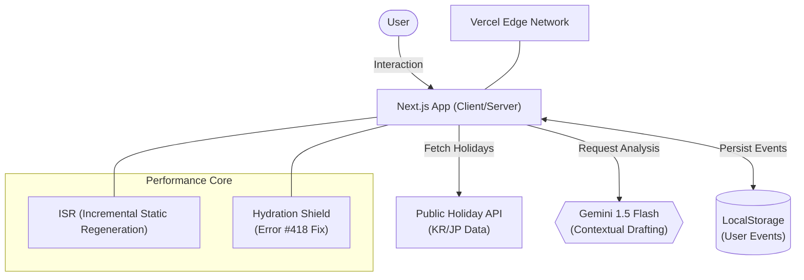

# 📋 JP-KR-Schedule-Bridge

An AI-powered collaboration assistant that synchronizes Korean and Japanese business schedules, identifies potential communication gaps due to different holidays, and automates professional bilingual mail drafting using Gemini AI

## 🎯 Background & Motivation
- **The Context**
  - Working in a Korea-Japan cross-border environment requires constant checking of two different holiday systems to avoid scheduling conflicts and communication delays

- **The Problem**
  1. Scheduling Blind Spots: Missing a Japanese "Golden Week" or Korean "Chuseok" often leads to urgent requests being ignored or project timelines being pushed back unexpectedly

  2. Communication Barriers: Drafting formal, urgent, or apologetic business emails in Japanese (Keigo) is mentally taxing and time-consuming for non-native engineers

  3. Performance & UX: Many existing calendar tools are heavy and slow, failing to provide the instant "at-a-glance" status needed in fast-paced IT environments

- **The Solution**
  1. Dual-Sync Visualization: A side-by-side calendar view that instantly highlights holiday conflicts and recommends the best collaboration days

  2. AI Business Agent: Integrated Gemini to generate context-aware business drafts (Formal/Urgent/Apology) based on specific calendar events

  3. Extreme Optimization: Lighthouse score by resolving hydration mismatches and implementing server-side optimization

- **Data Source**: Google Calendar API (JP), User Input (LocalStorage), Gemini AI Analysis

- **Key Features**
  1. Dual Calendar View: Synchronized display of KR/JP holidays

  2. Smart Business Advice: Real-time status analysis (e.g., "Today is a holiday in JP, expect delays")

  3. One-Click AI Mailer: Contextual email drafting with 3 distinct tones

  4. User Event Management: Add/Delete personal meetings with persistent storage

  5. Empty State Onboarding: Minimalist UI guide for first-time users

- **JP-KR-Schedule-Bridge Architecture (Mermaid)**

## 🛠 Tech Stack
- **Framework**:  (App Router)
- **Language**: 
- **Styling**: 
- **AI/LLM**:  | API
- **Deployment**: | CI/CD Pipeline
- **Libraries**: , 

## ✅ Milestone
- **Phase 1**: Foundation & Frontend Environment Setup
  - [x] Phase 1-1: Initialize GitHub Repository & Project Board
  - [x] Phase 1-2: Setup Next.js (App Router) & TypeScript Development Environment
  - [x] Phase 1-3: Configure Global Styling Strategy (Tailwind CSS & Business Theme)
  - [x] Phase 1-4: Security Setup (Environment Variables & .env Configuration)

- **Phase 2**: Holiday Data Acquisition & Modeling
  - [x] Phase 2-1: Research & Integrate Public Holiday APIs (KR/JP)
  - [x] Phase 2-2: Define TypeScript Interfaces for Holiday & Schedule Models
  - [x] Phase 2-3: Develop Data Fetching Utilities with Error Handling
  - [x] Phase 2-4: Implement Local Caching Logic for Performance Optimization

- **Phase 3**: Core Business & Comparison Logic
  - [x] Phase 3-1: Develop "Cross-Border Holiday Comparison" Engine
  - [x] Phase 3-2: Implement Long-term Vacation Detection (Golden Week, Chuseok, etc.)
  - [x] Phase 3-3: Build Context-Aware Alert Logic (Business Risk Assessment)
  - [x] Phase 3-4: Create Scheduling Recommendation Algorithm

- **Phase 4**: Advanced Web Interface & UX Development
  - [x] Phase 4-1: Build Interactive Dual-Calendar Dashboard UI
  - [x] Phase 4-2: Implement Real-time Schedule Conflict Visualization
  - [x] Phase 4-3: Develop Business Email Template Generator (KR/JP Bilingual)
  - [x] Phase 4-4: Implement Dynamic Calendar Navigation
  - [x] Phase 4-5: User-Defined Schedule Management & Data Persistence
  - [x] Phase 4-6: Integrate Gemini AI for Smart Email Generation

- **Phase 5**: Deployment, Documentation & Portfolio Finalization
  - [x] Phase 5-1: Cloud Deployment & CI/CD Pipeline Setup (Vercel)
  - [x] Phase 5-2: Performance Optimization (Server-side Rendering & Static Generation)
  - [] Phase 5-3: Comprehensive Technical Documentation (README & API Docs)
  - [] Phase 5-4: Global Localization & UX Optimization 
  - [] Phase 5-5: Code Refactoring & TypeScript Strict Mode Audit
  - [] Phase 5-6: Final Project Retrospective

## 🔥 Troubleshooting & Lessons Learned
**1. Hydration Mismatch (React Error#418)**
  - **Challenge**: Server-side rendering of dynamic dates caused a mismatch with client-side local time.

  - **Resolution**: Implemented a isLoaded state guard to isolate date-related rendering until the client-side mount, ensuring UI stability.

**2. AI Rate Limiting (429 Too Many Requests)**
  - **Challenge**: Frequent testing during development hit Gemini's free tier quotas.

  - **Resolution**: Switched to gemini-flash-latest for faster response times and implemented defensive error handling to notify users when quotas are reached.

**3. Accessibility & Contrast**
  - **Challenge**: Minimalist design with light grays (text-gray-400) failed WCAG accessibility standards.

  - **Resolution**: Conducted a contrast audit and refined colors to text-gray-500/600, achieving 100 in Accessibility without compromising the aesthetic.

## 📈 Results
- **Performance**: 100 (FCP: 0.3s, LCP: 0.5s)

- **Accessibility**: 95

- **Best Practices**: 100

- **SEO**: 100

## 🧐 Self-Reflection
Technical Growth
System Design: 환경 변수(Environment Variables) 기반의 설정 관리와 정교한 에러 마스킹(Error Masking)을 적용하여, 보안성이 높고 실제 운영 환경에 바로 투입 가능한 "Production-ready" 애플리케이션 구축 프로세스를 익혔습니다.

Global Mindset: 프로젝트 초기 단계부터 다국어 지원과 지역화(Localization)를 고려한 코드 구조를 설계하며, 글로벌 시장을 타겟으로 하는 소프트웨어 아키텍처의 중요성을 깊이 이해하게 되었습니다.

Problem-Solving Mindset
Bridge Builder: 개인적인 불편함(한·일 일정 조율)을 자동화하여 더 넓은 커뮤니티에 가치를 제공할 수 있는 솔루션을 만드는 과정에서, 진정한 소프트웨어의 가치는 현장의 페인 포인트(Pain Point)를 해결하는 '가교' 역할에 있음을 확인했습니다.

## 🧐 Final Project Retrospective

### 💡기술적 신뢰성을 향한 집념
이 프로젝트는 **'신뢰성'**에 초점을 맞췄습니다. 성능, 보안, SEO 항목에서 Lighthouse 100점을 달성하고, 접근성(Accessibility) 항목에서 95점이라는 높은 점수를 기록했습니다. 단순한 기능 구현을 넘어, 실제 서비스 수준의 최적화와 견고한 에러 핸들링을 통해 AI 기술이 비즈니스 환경에서도 충분히 안정적으로 작동할 수 있음을 증명했습니다.
- **Lighthouse Score**: 

### 🚀 Technical Evolution: Beyond CRUD
Moving from Project 2 (Python/Streamlit) to Project 3 (Next.js/TypeScript), I mastered the nuances of Modern Web Architecture. Dealing with Hydration errors and SSR/ISR taught me how to manage the lifecycle of data in a high-performance production environment.

### 🌏 Bridging Markets
As an aspiring IT solution engineer for the Japanese market, this tool represents my ability to identify cultural friction points and solve them using cutting-edge technology. It is not just a calendar, it is a communication bridge.

## ✨ Contact
- **Live Demo**: https://jp-kr-schedule-bridge.vercel.app

- **GitHub Repository**: https://github.com/2daKaizen-gun/jp-kr-schedule-bridge

- **Email**: hkys1223@gmail.com